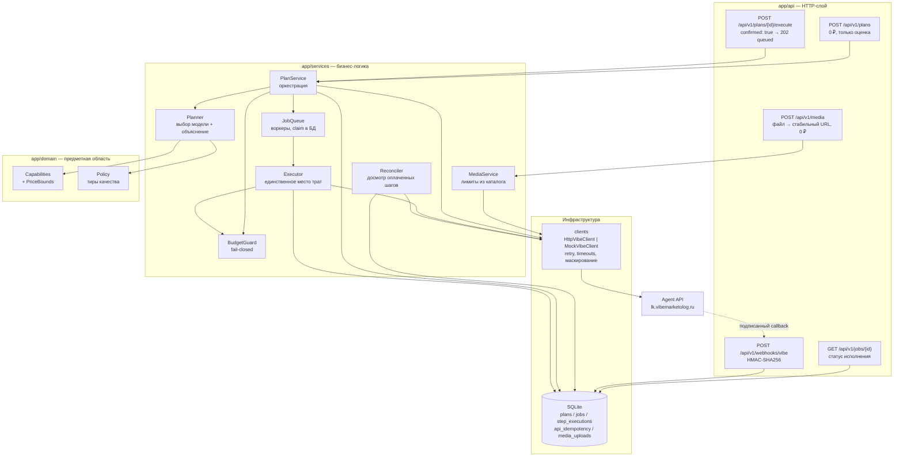

# Vibe Budget Agent

Cost-aware AI-агент поверх [Agent API «Вайб-Маркетолог»](https://lk.vibemarketolog.ru/docs/agent-api):
принимает маркетинговый бриф и рублёвый бюджет, сам подбирает модели, объясняет выбор,
считает стоимость **до** списания и выполняет генерацию только после явного подтверждения.

Главная гарантия: **агент не может потратить больше заданного бюджета** — ни при ошибке
планировщика, ни при изменении цены между планом и запуском, ни при повторном вызове execute.

---

## 1. Какую проблему решаем

Автономный агент, у которого есть ключ с доступом к платной генерации, — это процесс с
кошельком. Пользователь просит «сделай креативы под запуск», агент дёргает `POST /generate`
в цикле, и утром владелец ключа обнаруживает, что дневной лимит выбран за 4 минуты, половина
генераций — это неудачные попытки подобрать параметры, а объяснить, почему выбрана
`seedance-2` за 1188 ₽ вместо `nano-banana-2-lite` за 9 ₽, невозможно.

Vibe Budget Agent закрывает этот разрыв. Он превращает бриф в **проверенный план с ценником**:

| Что нужно бизнесу | Что делает агент |
|---|---|
| «Уложись в 1500 ₽» | Жёсткий бюджет-гард: план строится под бюджет, исполнение останавливается до первого рубля, если не укладывается |
| «Почему эта модель?» | Каждый шаг несёт `reason` + список отклонённых альтернатив с причинами |
| «Сколько это будет стоить?» | Цена каждого шага из `POST /generate/estimate` (dry-run, без списания) |
| «Не трать без меня» | `POST /plans` не тратит ничего; списание только при `{"confirmed": true}` |
| «Что в итоге получилось?» | Отчёт: статусы шагов, ссылки `display_url`, плановая и фактическая стоимость, ошибки, время |

## 2. Почему контроль бюджета — это архитектура, а не проверка `if`

У автономного агента четыре независимых способа перерасходовать деньги, и каждый закрыт
отдельным механизмом:

1. **Плохой выбор модели.** Каталог содержит модели от 1.2 ₽ до 1188 ₽ за запрос. Планировщик
   стартует с самой дешёвой совместимой модели и повышает качество только пока весь план
   помещается в бюджет.
2. **Неизвестная цена.** В `/capabilities` цена — *ориентировочная* (`"price = цена при
   дефолтных параметрах"`), у части моделей это `tier_prices`, у части — `price_formula` с
   оплатой за секунду, у озвучки — за начатую 1000 символов. Пока нет ответа `/generate/estimate`,
   агент считает по **консервативной верхней границе**: округление всегда в сторону «дороже».
   Отдельный случай — текстовые модели (`claude-opus-5`, `gpt-5.6-sol`): они
   тарифицируются по фактическим токенам, и цены в каталоге у них нет вовсе
   (`price: null`). Потолок даёт только `/generate/estimate` — как **резерв**
   `balance.current − balance.after_reserve` под переданный `max_tokens`. Агент всегда
   передаёт `max_tokens` (иначе цену нечем ограничить) и считает бюджет по резерву;
   фактически спишется не больше него. Если ни цены, ни резерва в ответе нет — шаг
   не выполняется, а текст собирается локально за 0 ₽.

3. **Дрейф цены между планом и запуском.** План может пролежать час. Перед исполнением агент
   переоценивает **каждый** шаг; любое подорожание останавливает весь запуск **без списания**.
4. **Повторы и сбои.** Ретрай, двойной клик по «выполнить», падение процесса между списанием и
   записью в БД — всё это без идемпотентности превращается в двойную оплату. Каждый шаг имеет
   детерминированный `idempotency_key` и строку в ledger-таблице, которая claim-ится **до** запуска.
   Исполнение вдобавок асинхронное, и это добавляет два своих способа заплатить дважды — два
   воркера на одном задании и перезапуск процесса посреди работы. Оба закрыты тем же приёмом:
   задание переводится `queued → running` условным `UPDATE`, который выигрывает ровно один
   исполнитель, а восстановленное после рестарта задание видит `generation_id` в ledger и
   **дожидается** результата вместо повторного запуска.

Плюс сквозной принцип **fail-closed**: если баланс неизвестен, `/generate/estimate` недоступен
или платформа не вернула цену — агент не тратит. Отказ дешевле неконтролируемого списания.

## 3. Архитектура



```text
app/
  api/          FastAPI-роутеры, схемы запросов/ответов, DI
  clients/      HTTP-клиент Agent API, mock-клиент, retry-политика, ошибки
  domain/       Brief, Capabilities + расчёт границ цены, Policy, Plan/Job
  services/     Planner, BudgetGuard, JobQueue, Executor, Reconciler, Retention, Media, вебхуки
  repositories/ SQLite: планы, задания, ledger шагов, ключи повтора, загрузки, аудит вебхуков
  core/         конфиг, логирование, маскирование секретов, ошибки
  main.py       сборка приложения, middleware, воркеры, обработчики ошибок
tests/          267 тестов, ни одного сетевого вызова и ни одного списания
scripts/        demo_mock.py — полная демонстрация без ключа
```

Границы слоёв жёсткие: `clients/` ничего не знает о бюджете, `services/` — о HTTP,
`domain/` не делает I/O. Поэтому планировщик тестируется без сети, а бюджет-гард — без БД.

## 4. Запуск через `uv`

```bash
uv sync                                   # установка (одна команда, Python 3.12)
uv run python scripts/demo_mock.py        # демо без ключа и без сети
uv run uvicorn app.main:app --reload      # http://127.0.0.1:8000/docs
```

Проверки:

```bash
uv run ruff check .    # линтер
uv run pytest -q       # тесты
```

Docker:

```bash
docker build -t vibe-budget-agent:0.1.0 .
docker run --rm -p 8000:8000 vibe-budget-agent:0.1.0   # по умолчанию APP_MODE=mock
docker compose up --build                              # то же самое через compose
```

Образ по умолчанию стартует в `mock`: без токена, без сети, без возможности списать деньги.

## 5. Настройка `.env`

```bash
cp .env.example .env
```

`.env` в `.gitignore`; `.env.example` содержит только плейсхолдеры. Ключевые переменные:

| Переменная | Назначение |
|---|---|
| `APP_MODE` | `mock` (по умолчанию) / `estimate` / `live` |
| `VIBE_API_TOKEN` | Bearer-токен. Единственный источник — переменная окружения |
| `VIBE_WEBHOOK_SECRET` | Секрет для проверки HMAC вебхуков |
| `VIBE_WEBHOOK_LEGACY_FALLBACK` | `true` только для токенов, выпущенных до 2026-07-09 (`secret = sha256(token)`) |
| `CALLBACK_BASE_URL` | Публичный адрес сервиса; пусто — работаем поллингом |
| `MAX_BUDGET_RUB` | Жёсткий потолок сервиса: бриф с бо́льшим бюджетом отклоняется (422) |
| `BUDGET_SAFETY_MARGIN` | Доля бюджета, которая не расходуется (резерв на дрейф цены), по умолчанию `0.05` |
| `EXECUTOR_CONCURRENCY` | Сколько подтверждённых планов исполняются одновременно (по умолчанию `2`); каждое задание захватывается в БД, поэтому увеличение не приводит к двойному запуску |
| `RECONCILE_INTERVAL_SECONDS` | Как часто досматривать оплаченные, но неотчитавшиеся шаги (по умолчанию `300`, `0` — выключить) |
| `RECONCILE_MIN_AGE_SECONDS` | Сколько шаг должен «повисеть», прежде чем его начнут догонять (по умолчанию `60`) |
| `RETENTION_INTERVAL_SECONDS` | Как часто чистить протухшие ключи повтора и мёртвые ссылки на файлы (`0` — выключить) |
| `IDEMPOTENCY_TTL_HOURS` | Сколько сохранённый ответ остаётся доступным для повтора (по умолчанию `24`) |
| `UPLOAD_EXPIRY_WARNING_DAYS` | За сколько дней до смерти ссылки предупреждать при построении плана (по умолчанию `2`) |
| `POLICY_FILE` | JSON с приоритетами моделей (пример — `policy.example.json`) |

Отдельно про поля брифа, влияющие на цену: `budget_rub` — жёсткий потолок плана;
`strategy` (`cheapest`/`balanced`/`quality`) — насколько агрессивно апгрейдить модели;
`text_max_tokens` (100–8000, по умолчанию из policy) — верхняя граница длины текста, а
значит и его цены: текстовые модели тарифицируются по токенам, и платформа резервирует
ровно эту сумму. Больше токенов — больше резерв и меньше места в бюджете на остальные форматы.

Токен и секрет хранятся как `SecretStr`, в логи попадает только отпечаток вида
`oc_l***cafe(len=36)`; заголовки `Authorization` и `X-Vibe-Signature` заменяются на
`***REDACTED***` фильтром, который стоит на **каждой** записи лога.

## 6. Mock-демонстрация (без ключа)

```bash
uv run python scripts/demo_mock.py --budget 400
```

Скрипт прогоняет настоящие планировщик, бюджет-гард, очередь заданий, executor и SQLite
против mock-клиента,
который отвечает **записанным слепком реального `GET /capabilities`**
(`app/clients/fixtures/capabilities.json`, 47 моделей). Вывод:

```text
1. ПЛАН (бюджет 400 ₽, списаний нет)
статус : ready
бюджет : 400.00 ₽ | к распределению 380.00 ₽ (резерв на дрейф цены 20.00 ₽)
итого  : 161.34 ₽ | остаток 238.66 ₽

 • text-1  → claude-opus-5  [6.84 ₽, источник цены: estimate]
   почему: … цена по /capabilities неизвестна: оплата по фактическим токенам, потолок —
   резерв под max_tokens из /generate/estimate
 • image-1 → nano-banana-pro-2k  [16.50 ₽, источник цены: estimate]
   почему: … policy-приоритет — tier 0, цена по /capabilities: фиксированная цена 16.5₽…
   отклонено:
     – gpt-image-2-edit: исключена policy-таблицей (служебная/цепочечная модель)
 • video-1 → veo3.1  [120.00 ₽, источник цены: estimate]
     – grok-itv: нет обязательных параметров: image_urls — бриф не содержит нужных исходников

2. ПОПЫТКА ИСПОЛНЕНИЯ БЕЗ ПОДТВЕРЖДЕНИЯ
отказано: ConfirmationRequiredError

3. ИСПОЛНЕНИЕ С confirmed=true
принято: статус «queued», списано 0.00 ₽ — исполнение ушло в фон
статус : succeeded    деньги: план 161.34 ₽ → факт 158.60 ₽ (токеновый шаг списал меньше резерва)

4. ПОВТОРНЫЙ EXECUTE
тот же job_id: True | факт списано повторно: 0.00 ₽ | вызовов POST /generate: 4
```

Тот же сценарий по HTTP: `APP_MODE=mock uv run uvicorn app.main:app` и запросы из §9.

**Обновление слепка каталога.** Каталог живой: за время разработки в нём появился целый
новый тип моделей (`text`). Слепок обновляется отдельной командой, которая сначала
показывает изменения и только потом пишет файл (`/capabilities` открыт без токена, 0 ₽):

```bash
uv run python scripts/refresh_capabilities.py           # показать diff
uv run python scripts/refresh_capabilities.py --write   # применить
uv run pytest -q                                        # тесты идут против слепка
```

Вывод — построчно: добавленные и удалённые модели, изменения цен и `required`/`optional`.

## 7. Безопасный режим `estimate`

```bash
APP_MODE=estimate VIBE_API_TOKEN=<ваш токен> uv run uvicorn app.main:app
```

Что делает: реальные `GET /capabilities`, `GET /me`, `GET /balance`, `POST /generate/estimate`.
Чего не делает: `POST /generate` недоступен вообще — `execute` возвращает `409 mode_not_allowed`
до любых сетевых вызовов. `/generate/estimate` по документации — dry-run без списания.

Это рекомендуемый режим для первого запуска с настоящим ключом: вы увидите реальные цены и
реальный баланс, ничем не рискуя.

## 8. Live-режим

> ⚠️ **ВНИМАНИЕ: `APP_MODE=live` списывает настоящие рубли с баланса владельца ключа.**
> Каждый успешный шаг плана — это реальная оплаченная генерация. Списание происходит только
> после `POST /api/v1/plans/{id}/execute` с телом `{"confirmed": true}`, но после этого
> подтверждения деньги уходят без дополнительных вопросов.

```bash
APP_MODE=live VIBE_API_TOKEN=<токен> VIBE_WEBHOOK_SECRET=<секрет> MAX_BUDGET_RUB=300 \
  uv run uvicorn app.main:app
```

Рекомендуемый порядок безопасной живой демонстрации:

1. Поставьте в кабинете дневной лимит токена (например 300 ₽) — это внешний предохранитель.
2. Задайте `MAX_BUDGET_RUB=300` — внутренний потолок сервиса.
3. Начните с брифа на один формат `["image"]` и `budget_rub: 20` (≈ одна картинка).
4. Постройте план через `POST /api/v1/plans`, прочитайте `total_estimated_rub` и `reason`.
5. Только если цифра устраивает — вызовите `execute` с `{"confirmed": true}`; в ответ
   придёт `202` и `job_id`, деньги ещё не тронуты.
6. Следите за `GET /api/v1/jobs/{job_id}`: пока `queued`/`running` — идёт работа; в конце
   смотрите `actual_cost_rub` и `display_url`.

`GET /health` всегда показывает `live_spending_enabled`, чтобы нельзя было перепутать режим.

## 9. Примеры запросов и ответов

### Построение плана (ничего не списывает)

```bash
curl -X POST http://127.0.0.1:8000/api/v1/plans \
  -H 'Content-Type: application/json' \
  -d '{
    "product_name": "CRM для мастеров маникюра",
    "product_description": "Онлайн-запись, напоминания клиентам и учёт расходников.",
    "target_audience": "Мастера маникюра и небольшие студии, 22–40 лет",
    "offer": "Первый месяц бесплатно, перенос базы клиентов за нас",
    "formats": ["text", "image", "voice"],
    "budget_rub": 120,
    "style": "дружелюбный, живой, без канцелярита",
    "aspect_ratio": "9:16",
    "text_max_tokens": 900
  }'
```

`201 Created` (реальный ответ в mock-режиме, показан один шаг из трёх):

```json
{
  "plan_id": "3e714fa7-4f4f-4371-b2e5-13ec83ed6be0",
  "mode": "mock",
  "status": "ready",
  "currency": "RUB",
  "budget_rub": 120.0,
  "safety_margin_rub": 6.0,
  "spendable_rub": 114.0,
  "total_estimated_rub": 34.5,
  "budget_remaining_rub": 85.5,
  "steps": [
    {
      "step_id": "text-1",
      "format": "text",
      "kind": "generation",
      "type": "text",
      "model": "claude-opus-5",
      "params": { "max_tokens": 900, "system": "…", "prompt": "Ты — маркетолог. Напиши рекламный текст…" },
      "estimated_cost_rub": 7.75,
      "cost_source": "estimate",
      "cost_basis": "POST /generate/estimate: 7.75₽ — резерв под max_tokens (balance.current − balance.after_reserve); в /capabilities цены нет (оплата по токенам)",
      "reason": "Модель claude-opus-5 выбрана для формата «text»: совместима с брифом (required=['prompt']), policy-приоритет — tier 0, цена по /capabilities неизвестна: оплата по фактическим токенам…"
    },
    {
      "step_id": "voice-1",
      "format": "voice",
      "kind": "generation",
      "type": "voice",
      "model": "gemini-pro-tts",
      "params": {
        "voice_name": "Puck",
        "prompt": "CRM для мастеров маникюра. Онлайн-запись, напоминания клиентам…"
      },
      "idempotency_key": "aaf08e8d-9a4a-531f-8c5d-7618af89aa23",
      "estimated_cost_rub": 18.0,
      "cost_source": "estimate",
      "cost_basis": "POST /generate/estimate: 18.00₽ (оценка по /capabilities была 18.00₽)",
      "reason": "Модель gemini-pro-tts выбрана для формата «voice»: совместима с брифом (required=['prompt']), policy-приоритет — tier 0, цена по /capabilities: 18.0₽ за начатую 1000 символов × 1 (длина промпта 173). Рассмотрено кандидатов: 7 совместимых, 0 отклонено на этапе совместимости.",
      "rejected_alternatives": [
        { "model": "el-tts-multilingual-v2", "reason": "дороже (39.00₽) при tier 0" },
        { "model": "gemini-flash-tts", "reason": "дешевле (13.00₽), но ниже по policy-приоритету (tier 1)" }
      ],
      "warnings": []
    }
  ],
  "warnings": [
    "Режим APP_MODE=mock: платная генерация отключена, план носит справочный характер."
  ],
  "account": { "balance_rub": 5000.0, "daily_limit_rub": 5000.0, "daily_spent_rub": 0.0, "source": "mock" },
  "capabilities_fingerprint": "0fc86b6afdb4a690"
}
```

### Исполнение (только с подтверждением, асинхронно)

`execute` не держит соединение на время генерации: он принимает план и отвечает `202`
с заданием в статусе `queued`. Списаний в этот момент ещё нет — их сделает фоновый
воркер, забрав задание из очереди.

```bash
curl -i -X POST http://127.0.0.1:8000/api/v1/plans/3e714fa7-.../execute \
  -H 'Content-Type: application/json' -d '{"confirmed": true}'
```

```http
HTTP/1.1 202 Accepted
Location: /api/v1/jobs/3ff045fc-3a8e-48d5-9167-69f6b466410b
```
```json
{ "job_id": "3ff045fc-3a8e-48d5-9167-69f6b466410b", "status": "queued",
  "estimated_cost_rub": 34.5, "actual_cost_rub": 0.0 }
```

Дальше — `GET /api/v1/jobs/{job_id}` (адрес продублирован в `Location`) или подписанный
вебхук: он закрывает шаги по мере готовности и завершает задание, когда не осталось
незакрытых шагов. Терминальные статусы: `succeeded`, `partial`, `failed`, `aborted`.

Есть третий путь — на случай, когда не сработали первые два. Если вебхук не дошёл, а опрос
упёрся в `POLL_TIMEOUT_SECONDS`, шаг закрывается как `failed` по таймауту, хотя деньги уже
списаны и генерация продолжается: такой отчёт врёт про потраченное. Фоновый досмотр
(`RECONCILE_INTERVAL_SECONDS`) периодически переспрашивает платформу про запущенные шаги,
у которых нет вердикта, и переписывает шаг и задание по факту — вплоть до перехода задания
из `failed` в `succeeded`. Досмотр только читает статусы: он ничего не запускает и не тратит.

Для демо и коротких планов удобнее дождаться результата сразу — `{"wait": true}` возвращает
`200` с уже готовым отчётом (та же логика, просто выполненная в этом же запросе):

```bash
curl -X POST http://127.0.0.1:8000/api/v1/plans/3e714fa7-.../execute \
  -H 'Content-Type: application/json' -d '{"confirmed": true, "wait": true}'
```

```json
{
  "job_id": "3ff045fc-3a8e-48d5-9167-69f6b466410b",
  "plan_id": "3e714fa7-4f4f-4371-b2e5-13ec83ed6be0",
  "status": "succeeded",
  "budget_rub": 120.0,
  "estimated_cost_rub": 34.5,
  "actual_cost_rub": 34.5,
  "budget_remaining_rub": 85.5,
  "steps": [
    {
      "step_id": "image-1",
      "model": "nano-banana-pro-2k",
      "status": "succeeded",
      "generation_id": 5811,
      "idempotency_key": "d15502bb-dd3f-5c79-90cb-9a06b29b64ba",
      "estimated_cost_rub": 16.5,
      "actual_cost_rub": 16.5,
      "refunded": false,
      "display_url": "https://lk.vibemarketolog.ru/files/generation/5811?…",
      "error": null,
      "duration_seconds": 0.006
    }
  ],
  "errors": [],
  "duration_seconds": 0.012
}
```

Без подтверждения — `400`, и ни одного обращения к платному эндпоинту:

```json
{ "status": "error", "error": "confirmation_required",
  "message": "Исполнение требует явного подтверждения: передайте {\"confirmed\": true}." }
```

Если цена выросла между планом и запуском, воркер останавливается до первого рубля, и
`GET /api/v1/jobs/{id}` показывает `aborted` с `actual_cost_rub = 0`:

```json
{ "status": "aborted", "actual_cost_rub": 0.0,
  "errors": ["Шаг «image-1» (nano-banana-pro-2k): цена изменилась с 16.50₽ до 24.75₽ (+8.25₽) — исполнение отменено без списания."] }
```

Отменённый запуск ничего не потратил, поэтому план остаётся в статусе `ready`/`degraded`:
его можно перепланировать и запустить снова, когда цена вернётся.

### Загрузка медиа (0 ₽) — доступ к image-to-video

Самые интересные видео-модели — `veo3.1`, `kling-3.0`, `grok-itv` — это image-to-video: всем
нужен обязательный `image_urls` со **стабильным** URL. Пока файл некуда положить, планировщик
честно отклоняет их («нет обязательных параметров: `image_urls`»), и пользователю остаётся
искать хостинг самому. `POST /api/v1/media` замыкает круг внутри API:

```bash
curl -X POST http://127.0.0.1:8000/api/v1/media -F 'file=@frame.png'
```

```json
{
  "url": "https://lk.vibemarketolog.ru/files/media/8f2c…png",
  "kind": "image", "size_bytes": 254318, "expires_in_days": 7,
  "usage": "Подставьте url в reference_image_urls брифа — это разблокирует image-to-video модели…"
}
```

Дальше этот `url` идёт в `reference_image_urls` брифа, и модели, которые раньше отсеивались,
попадают в план. Загрузка бесплатна и бюджета не касается.

Ссылки живут 7 дней, и агент это помнит: при построении плана он проверяет `reference_image_urls`
по собственным загрузкам и предупреждает заранее — «перестанет работать через 1.3 дн.» или «уже
недействительна». Узнать о мёртвой ссылке **после** подтверждения списания — худший из возможных
моментов. Про чужие ссылки честно сообщает, что срок их жизни ему неизвестен.

Размер и формат проверяются **до** отправки файла, а лимиты берутся из `/capabilities`
(`upload_endpoint.limits`), а не захардкожены: если платформа поднимет потолок или добавит
формат — сервис последует за ней. Посмотреть действующие правила: `GET /api/v1/media/limits`
(`source: capabilities` — прочитано из каталога, `fallback` — каталог недоступен, действуют
консервативные значения по документации). Файл сверх лимита обрывается на чтении и по сети
не едет. Загруженные ссылки живут 7 дней — план, построенный на протухшей ссылке, упадёт
при исполнении.

### Повтор запроса: `Idempotency-Key`

Внутри агент от повторов защищён полностью — шаг захватывается в ledger, задание в своей
строке. Не защищён ровно клиент: если соединение оборвалось после `/execute`, он не знает,
приняли план или нет, и повторяет вслепую. Необязательный заголовок закрывает и это.

```bash
curl -X POST http://127.0.0.1:8000/api/v1/plans/3e714fa7-.../execute \
  -H 'Idempotency-Key: req-7f3a-0001' \
  -H 'Content-Type: application/json' -d '{"confirmed": true}'
```

Повтор с тем же ключом и тем же телом возвращает **сохранённый ответ первой попытки** — тот же
код, то же тело, тот же `Location` — и помечает его `Idempotency-Replayed: true`; работа заново
не делается. Тот же ключ с другим телом (или на другом плане) — `409 idempotency_key_reused`:
это не повтор, а новый запрос, и ему нужен новый ключ. Пока первая попытка выполняется,
параллельный повтор получает `409 idempotency_key_in_flight`, а не тихий второй запуск.

Отказ ключ не сжигает: если запрос отклонён валидацией или отсутствием подтверждения, тот же
ключ можно использовать снова — иначе одна опечатка в брифе делала бы ключ непригодным.

Сохранённые ответы живут `IDEMPOTENCY_TTL_HOURS` (по умолчанию сутки), после чего фоновая
чистка их удаляет и тот же ключ снова означает новый запрос. Незавершённая заявка не удаляется
никогда: иначе чистка отпустила бы ключ запроса, который прямо сейчас выполняется.

### Отчёт, здоровье, вебхук

```bash
curl http://127.0.0.1:8000/api/v1/jobs/3ff045fc-...
curl http://127.0.0.1:8000/health
# {"status":"ok","mode":"mock","version":"0.1.0","database":"ok",
#  "upstream":"mock (сеть не используется)","live_spending_enabled":false,
#  "queue_depth":0,"executor_workers":2,"tracing":"disabled"}

# Неподписанный вебхук всегда отвергается и ничего не меняет:
curl -i -X POST http://127.0.0.1:8000/api/v1/webhooks/vibe -d '{"generation_id":5811}'
# HTTP/1.1 401  {"error":"invalid_signature", …}
```

Подпись проверяется по схеме из документации — `HMAC-SHA256(raw_body, webhook_secret)`,
сравнение constant-time, **по сырым байтам до разбора JSON**.

Проверить настройку вебхуков можно, ничего не потратив:

```bash
# 1. Локально: подписываем событие вашим настоящим VIBE_WEBHOOK_SECRET,
#    проверяем, что валидное принимается, а подделанное/неподписанное — нет.
uv run python scripts/webhook_check.py

# 2. Сквозно: платформа сама присылает подписанное событие (POST /webhook-test, 0 ₽).
#    Нужен публичный адрес — сервис за туннелем:
uv run uvicorn app.main:app --port 8000        # терминал 1
ngrok http 8000                                # терминал 2, берём https://<...>.ngrok.app
uv run python scripts/webhook_check.py --public https://<...>.ngrok.app
```

Второй режим ждёт запись в таблице `webhook_events` — а она появляется только после
успешной проверки HMAC, так что «дошло» и «принято» здесь одно и то же. Для токенов, выпущенных до
2026-07-09, поддержан legacy-вариант `secret = sha256(api_token)` (включается флагом).

## 10. Наблюдаемость: куда ушли деньги

Для процесса с кошельком «сколько потрачено» — это не служебная телеметрия, а часть
отчётности. Поэтому метрики считаются **из БД**, а не из счётчиков в памяти: цифры
переживают перезапуск и не могут разойтись с отчётами по заданиям.

```bash
curl http://127.0.0.1:8000/metrics
```

```text
vibe_plan_estimated_rub_total 23.3400
vibe_job_estimated_rub_total 23.3400
vibe_job_actual_rub_total 20.6000        # факт ниже плана: токеновый шаг списал меньше резерва
vibe_refunded_steps_total 0
vibe_jobs_total{status="succeeded"} 1
vibe_jobs_total{status="aborted"} 0      # остановлено бюджетным гардом до списания
vibe_steps_total{status="succeeded"} 2
vibe_queue_depth 0
vibe_app_info{mode="mock",tracing="disabled",version="0.1.0"} 1
```

Доли не публикуются готовыми — они считаются запросом, как принято в Prometheus:

```promql
# доля запусков, остановленных бюджетным гардом
sum(vibe_jobs_total{status="aborted"}) / sum(vibe_jobs_total)
# насколько план расходится с фактом
vibe_job_actual_rub_total / vibe_job_estimated_rub_total
```

Все известные статусы публикуются даже нулевыми: пропавшая серия ломает дашборд.
Эндпоинт не отдаёт секретов, но описывает чужой бюджет — держите его на внутреннем
маршруте, не на публичном ingress.

**Трейсинг — опциональный.** Транспорт, сэмплирование и инструментирование HTTP отданы
стандартному запускателю, а в коде живёт только то, чего автоинструментирование дать не
может: доменные спаны `plan.create`, `job.run` и `step.generate` с моделью, плановой и
фактической ценой на них. Именно это превращает трейс в ответ на вопрос «почему запуск
стоил 1188 ₽».

```bash
uv sync --extra otel
uv run --extra otel opentelemetry-instrument \
  --traces_exporter otlp --service_name vibe-budget-agent \
  uvicorn app.main:app
```

Без пакетов OTel (установка по умолчанию) или без настроенного экспортёра `span()` —
пустышка, и сервис ведёт себя ровно как раньше: трейсинг никогда не должен быть причиной
падения запроса. Текущее состояние видно в `GET /health` → `tracing`: `disabled` (пакеты не
установлены) / `available` (установлены, экспортёр не настроен) / `otel` (работает).
`correlation_id` из заголовка `X-Correlation-Id` попадает и в логи, и в спаны, и в
исходящие запросы к платформе — один идентификатор связывает всё.

## 11. Архитектурные решения и компромиссы

| Решение | Почему | Компромисс |
|---|---|---|
| Цена из `/capabilities` — только пред-фильтр, авторитет у `/generate/estimate` | В каталоге цена ориентировочная (`tier_prices`, `price_formula`, оплата за 1000 символов) | Один `estimate` на шаг при построении плана и ещё один при запуске |
| Консервативная верхняя оценка (`max(tier_prices)`, `per_second × max_duration`) | Ошибка «дороже, чем есть» безопасна, «дешевле» — нет | Иногда модель отсеивается по бюджету зря; точная цена придёт из `estimate` |
| Policy-таблица только для *качества*, совместимость — динамически из `required` | Новая модель в каталоге сразу доступна к выбору; ничего не ломается при изменении цен | Порядок «премиальности» требует ручной актуализации, иначе новая модель идёт в нейтральный тир |
| Планировщик стартует с самого дешёвого набора и апгрейдит | Гарантия «влезаем в бюджет» устанавливается до апгрейдов и не может быть нарушена ими | Может остаться неизрасходованный остаток — агент не тратит просто потому, что деньги есть |
| Любое подорожание блокирует запуск целиком | Частичный запуск «того, что подешевело» непредсказуем для пользователя | Придётся перестроить план — это одна бесплатная операция |
| Последовательное исполнение шагов | Бюджет проверяется перед каждым списанием; параллелизм превращает учёт в гонку | Дольше по времени на многошаговых планах |
| SQLite + ledger `step_executions` с `UNIQUE (plan_id, step_id)` | Защита от двойного списания переживает рестарт процесса | Один инстанс на файл БД; для нескольких реплик нужен Postgres |
| `execute` асинхронный: `202` + `job_id`, работа в фоне | Долгая видео-генерация не держит HTTP-соединение, а отказ по подтверждению/режиму/бюджету плана всё равно приходит сразу | Клиенту нужен второй шаг — опрос `GET /jobs/{id}` или вебхук; для демо оставлен `{"wait": true}` |
| Очередь — `asyncio` внутри процесса, а не Redis/arq | Ноль внешних зависимостей: демо и тесты запускаются одной командой, без брокера | Одна реплика; при переезде на несколько нужен внешний брокер (подмена только в `main.py`) |
| Задание «захватывается» условным `UPDATE ... WHERE status='queued'` | Строка в БД, а не логика в коде, решает, кто исполняет: двойной enqueue, второй воркер и восстановление после рестарта безопасны by design | Требует, чтобы статус жил и в колонке, и в JSON-документе — они меняются одним запросом через `json_set` |
| При возобновлении после рестарта переоценка цен пропускается | Деньги за запущенные шаги уже ушли; отменять такой job из-за скачка цены поздно и вредно — правильнее дождаться результатов | Возобновлённый job не проверяет цену повторно; защищает только ledger и уже сделанный `claim` |
| Метрики считаются из БД на каждый scrape, а не копятся в памяти | «Сколько потрачено» обязано пережить перезапуск и совпасть с отчётами по заданиям; счётчик в памяти врёт после каждого рестарта | Несколько агрегирующих запросов на scrape — приемлемо на этом масштабе, но не бесплатно при миллионах заданий |
| Трейсинг опционален и отдан `opentelemetry-instrument` | Установка по умолчанию остаётся лёгкой, демо не требует коллектора; транспорт и сэмплирование — не наша задача | Из коробки трейсов нет; в коде живут только доменные спаны, HTTP-инструментирование появляется лишь с extra `otel` |
| Лимиты загрузки читаются из `upload_endpoint.limits` каталога, а не захардкожены | Отклонить файл, который платформа приняла бы, — это наш баг, а не проблема пользователя | Лимиты записаны прозой (`"30 MB (jpeg/png/webp/gif)"`), парсинг регуляркой; при непонятном формате действует консервативный fallback |
| `Idempotency-Key` хранит **ответ**, а не только факт запроса | Клиенту, потерявшему соединение, нужен именно ответ первой попытки; «мы это уже видели» ему бесполезно | Тело ответа дублируется в БД и живёт до `IDEMPOTENCY_TTL_HOURS`; после этого повтор станет новым запросом |
| Чистка трогает только ключи повтора и мёртвые ссылки | Планы, задания и ledger шагов — денежный след, его нельзя терять по расписанию | Эти три таблицы растут неограниченно; для долгой работы нужна архивация, а не удаление |
| Отдельный досмотр шагов, оплаченных но не отчитавшихся | Таймаут ожидания — это «мы не дождались», а не «шаг провалился»: деньги списаны, генерация идёт. Отчёт, называющий такой шаг `failed`, врёт про потраченное | Итоговый статус задания может измениться задним числом (`failed → succeeded`); в отчёте остаётся запись, что шаг переписан досмотром |
| Токеновые модели (`text`) оцениваются по резерву `balance.current − balance.after_reserve` | У них нет цены в `/capabilities`; резерв — это потолок, фактически спишется меньше | Бюджет резервируется «с запасом», часть остатка не используется |
| Текстовая генерация синхронная: результат приходит в ответе `POST /generate`, а `status` отдаёт `output: null` | Так работает платформа — проверено на живом API | Текст надо забирать сразу из ответа; для длинных задач это держит соединение |
| План пересобирается один раз после точных оценок | Цену токеновых моделей до `/generate/estimate` знать нельзя; иначе шаг пришлось бы удалять целиком | Один дополнительный (бесплатный) раунд оценок, когда план не влез |
| Сценарий озвучки длиннее лимита модели не режется, а отправляется в длинную озвучку | Обрезать текст, который написал пользователь, — потеря смысла; `el-tts-turbo` принимает до 200 000 знаков и склеивает результат | Длинный текст дороже (цена за каждую начатую 1000 знаков) и опрашивается через отдельный `GET /voiceover/long/{id}` |
| Формат `text` имеет бесплатный локальный fallback | Если платная текстовая модель не подошла или не влезла в бюджет, бриф всё равно получает текст | Локальный копирайт шаблонный; это честный 0 ₽, а не имитация LLM |
| Mock на записанном слепке реального `/capabilities` | Демо и тесты идут по настоящим именам моделей и параметров | Слепок нужно обновлять (`GET /capabilities` открыт без токена) |

### Что покрыто тестами (267 шт., все офлайн)

`tests/test_budget.py` — запрет превышения бюджета и fail-closed по балансу/дневному лимиту ·
`test_price_change.py` — дрейф цены между планом и запуском ·
`test_idempotency.py` — вывод ключей и ledger ·
`test_retry.py` — backoff с jitter, `Retry-After`, отсутствие ретраев на 4xx ·
`test_planner.py` — совместимость моделей, enum/limits, детерминизм, границы цены ·
`test_webhook.py` — HMAC, legacy-схема, подделка тела ·
`test_masking.py` — маскирование токенов в логах ·
`test_token_billed.py` — токеновая тарификация text-моделей через резерв ·
`test_config.py` — пустые переменные `.env` и загрузка policy-файла ·
`test_long_voiceover.py` — длинная озвучка: выбор модели, цена, опрос и возврат ·
`test_partial_failure.py` — частичное падение многошагового плана ·
`test_execute_replay.py` — повторный execute ·
`test_async_execution.py` — приём `202`, фоновое исполнение, захват задания одним воркером,
возобновление после рестарта без повторного списания, устойчивость воркеров ·
`test_reconcile.py` — досмотр после таймаута: поиск зависших шагов, перезапись отчёта,
сохранение фактической стоимости, возврат средств, неизвестная платформе генерация ·
`test_input_idempotency.py` — `Idempotency-Key` на входе: повтор ответа, конфликт при
изменённом теле, привязка ключа к плану, одновременные повторы, отказ не сжигает ключ ·
`test_media_upload.py` — загрузка медиа: разбор лимитов из каталога, обрыв чтения на
превышении, полный круг «файл → URL → image-to-video модель в плане» ·
`test_observability.py` — метрики совпадают с отчётами по заданиям и переживают перезапуск;
доменные спаны проверены против настоящего OTel SDK, а не только в виде заглушки ·
`test_retention.py` — чистка не трогает свежие и незавершённые ключи, предупреждения о
протухающих и мёртвых ссылках при планировании, устойчивость периодического цикла ·
`test_api.py` — HTTP-контракт.

## 12. Что доработать для production

- **Хранилище и очередь для нескольких реплик.** Postgres вместо SQLite (транзакционный ledger,
  `SELECT … FOR UPDATE SKIP LOCKED` вместо условного `UPDATE`) и внешний брокер (arq/Celery)
  вместо очереди внутри процесса. Контракт воркера уже сведён к «доставить `job_id` хотя бы
  один раз», поэтому это замена проводки в `main.py`, а не переделка логики.
- **Архивация денежного следа.** `plans`, `jobs` и `step_executions` не чистятся принципиально,
  но и не архивируются: на длинной дистанции нужен перенос старых записей в холодное хранилище.
- **Бюджеты как сущность.** Лимиты на проект/пользователя/сутки поверх пошагового бюджета,
  учёт фактических трат за период, алерты при приближении к лимиту.
- **Перезагрузка протухших ссылок.** Агент предупреждает, что ссылка умирает, но не может
  обновить её сам — исходный файл у него не хранится. Нужен либо кэш оригиналов, либо
  повторная загрузка по требованию пользователя.
- **Дашборд поверх метрик.** `/metrics` отдаёт числа, но готовой панели Grafana в репозитории
  нет; на больших объёмах агрегаты на каждый scrape стоит заменить материализованной сводкой.
- **Качество контента.** Сейчас промпты собираются детерминированно из брифа; следующий шаг —
  LLM-копирайтер с оценкой качества и A/B-вариантами при том же бюджет-гарде.
- **Ротация ключей и аудит.** Хранение токена в secret manager, аудит-лог всех списаний
  с привязкой к пользователю, который нажал «подтвердить».

---

## Предложение для Agent API: нативный `POST /plan`

Сейчас, чтобы безопасно потратить деньги, агент обязан сам собрать конвейер:
`/capabilities` → фильтрация по `required` → подбор параметров под `enums`/`limits` →
N × `/generate/estimate` → собственная арифметика бюджета → N × `/generate`. Это 4–6 сетевых
раундов и, что важнее, **своя копия логики ценообразования** в каждом клиенте: в этом проекте
пришлось руками разбирать `tier_prices`, `price_formula`/`per_second` и оплату за начатую
1000 символов, потому что однозначная цена шага из каталога заранее не выводится.

### Идея

Один эндпоинт, который принимает **цель и бюджет**, а возвращает **проверенный план без списания**.

```http
POST /api/agent/plan
Authorization: Bearer <token>

{
  "goal": "Промо-кампания CRM для мастеров маникюра, оффер «первый месяц бесплатно»",
  "audience": "мастера маникюра и небольшие студии, 22–40 лет",
  "deliverables": [
    {"type": "image", "count": 2, "aspect_ratio": "9:16"},
    {"type": "voice", "text_length": 600},
    {"type": "video", "duration": 8}
  ],
  "budget_rub": 1500,
  "strategy": "balanced",
  "constraints": {"max_per_step_rub": 400, "exclude_models": ["veo3"]}
}
```

```json
{
  "plan_id": "pln_7c1f…",
  "valid": true,
  "total_cost_rub": 1284.5,
  "budget_remaining_rub": 215.5,
  "expires_at": "2026-07-28T20:30:00+00:00",
  "balance": {"current": 4820, "after": 3535.5},
  "daily_spend": {"limit": 5000, "today": 340, "within_limit": true},
  "steps": [
    {
      "step_id": "img_1",
      "type": "image",
      "model": "nano-banana-pro-2k",
      "params": {"prompt": "…", "aspect_ratio": "9:16"},
      "estimated_cost_rub": 16.5,
      "reason": "лучшее качество в рамках остатка бюджета; альтернативы: z-image (1.2₽, ниже качество), seedream-5-pro (40₽, не влезает)",
      "idempotency_key": "…"
    }
  ],
  "warnings": ["музыка исключена: не хватает бюджета после видео"]
}
```

И запуск подтверждённого плана одним вызовом:

```http
POST /api/agent/plan/{plan_id}/execute
{"confirmed": true, "max_total_rub": 1500}
```

Платформа проверяет, что план не истёк, цены не изменились и `total_cost_rub ≤ max_total_rub`,
и только тогда запускает шаги — иначе возвращает `409 plan_stale` с актуальной ценой.

### Польза для бизнеса

- **Снимает главный барьер входа для автономных агентов.** Сегодня разработчик агента обязан
  сам построить всё, что описано в этом README, — иначе его агент небезопасен для чужого
  кошелька. Нативный `/plan` делает безопасный сценарий сценарием по умолчанию.
- **Меньше неудачных платных вызовов.** Параметры подбирает та сторона, которая знает схему
  моделей: падает доля `validation_failed` и срабатываний «key cooling» из-за >80% ошибок.
- **Понятный лимит риска для владельца ключа.** `max_total_rub` в запросе исполнения — это
  контракт «дороже не спишется», подтверждаемый платформой, а не обещание клиента.
- **Апсейл через прозрачность.** Пользователь видит «за +180 ₽ доступна модель уровнем выше» —
  это аргумент за увеличение бюджета, а не за отказ от генерации.
- **Меньше споров и возвратов.** План с `reason` по каждому шагу — готовое объяснение, почему
  списаны деньги; поддержке не нужно реконструировать логику чужого агента.
- **Данные для продукта.** Неподтверждённые планы показывают, где цена ломает сценарий, а какие
  связки моделей востребованы вместе.

Совместимость полная: `/plan` — надстройка над существующими `/capabilities`, `/generate/estimate`
и `/generate`; ломать ничего не нужно, а клиенты вроде этого проекта смогут постепенно заменить
свою локальную логику на один вызов.
# agent_006
