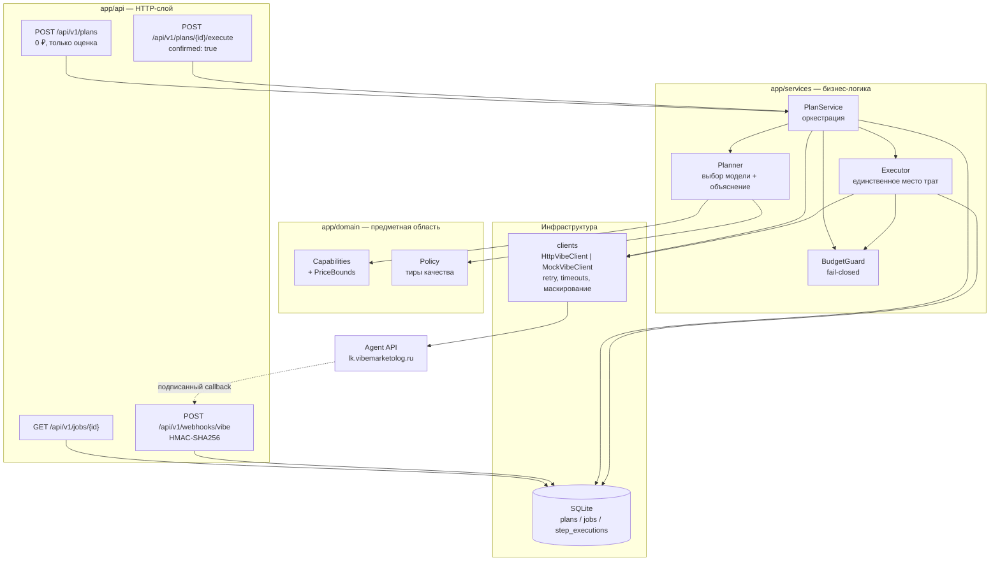

# Vibe Budget Agent

Cost-aware AI-агент поверх [Agent API «Вайб-Маркетолог»](https://lk.vibemarketolog.ru/docs/agent-api):
принимает маркетинговый бриф и рублёвый бюджет, сам подбирает модели, объясняет выбор,
считает стоимость **до** списания и выполняет генерацию только после явного подтверждения.

Главная гарантия: **агент не может потратить больше заданного бюджета** — ни при ошибке
планировщика, ни при изменении цены между планом и запуском, ни при повторном вызове execute.

---

## 1. Какую проблему решаем

Автономный агент, у которого есть ключ с доступом к платной генерации, — это процесс с
кошельком. Пользователь просит «сделай креативы под запуск», агент дёргает `POST /generate`
в цикле, и утром владелец ключа обнаруживает, что дневной лимит выбран за 4 минуты, половина
генераций — это неудачные попытки подобрать параметры, а объяснить, почему выбрана
`seedance-2` за 1188 ₽ вместо `nano-banana-2-lite` за 9 ₽, невозможно.

Vibe Budget Agent закрывает этот разрыв. Он превращает бриф в **проверенный план с ценником**:

| Что нужно бизнесу | Что делает агент |
|---|---|
| «Уложись в 1500 ₽» | Жёсткий бюджет-гард: план строится под бюджет, исполнение останавливается до первого рубля, если не укладывается |
| «Почему эта модель?» | Каждый шаг несёт `reason` + список отклонённых альтернатив с причинами |
| «Сколько это будет стоить?» | Цена каждого шага из `POST /generate/estimate` (dry-run, без списания) |
| «Не трать без меня» | `POST /plans` не тратит ничего; списание только при `{"confirmed": true}` |
| «Что в итоге получилось?» | Отчёт: статусы шагов, ссылки `display_url`, плановая и фактическая стоимость, ошибки, время |

## 2. Почему контроль бюджета — это архитектура, а не проверка `if`

У автономного агента четыре независимых способа перерасходовать деньги, и каждый закрыт
отдельным механизмом:

1. **Плохой выбор модели.** Каталог содержит модели от 1.2 ₽ до 1188 ₽ за запрос. Планировщик
   стартует с самой дешёвой совместимой модели и повышает качество только пока весь план
   помещается в бюджет.
2. **Неизвестная цена.** В `/capabilities` цена — *ориентировочная* (`"price = цена при
   дефолтных параметрах"`), у части моделей это `tier_prices`, у части — `price_formula` с
   оплатой за секунду, у озвучки — за начатую 1000 символов. Пока нет ответа `/generate/estimate`,
   агент считает по **консервативной верхней границе**: округление всегда в сторону «дороже».
3. **Дрейф цены между планом и запуском.** План может пролежать час. Перед исполнением агент
   переоценивает **каждый** шаг; любое подорожание останавливает весь запуск **без списания**.
4. **Повторы и сбои.** Ретрай, двойной клик по «выполнить», падение процесса между списанием и
   записью в БД — всё это без идемпотентности превращается в двойную оплату. Каждый шаг имеет
   детерминированный `idempotency_key` и строку в ledger-таблице, которая claim-ится **до** запуска.

Плюс сквозной принцип **fail-closed**: если баланс неизвестен, `/generate/estimate` недоступен
или платформа не вернула цену — агент не тратит. Отказ дешевле неконтролируемого списания.

## 3. Архитектура



```text
app/
  api/          FastAPI-роутеры, схемы запросов/ответов, DI
  clients/      HTTP-клиент Agent API, mock-клиент, retry-политика, ошибки
  domain/       Brief, Capabilities + расчёт границ цены, Policy, Plan/Job
  services/     Planner, BudgetGuard, Executor, PlanService, промпты, вебхуки
  repositories/ SQLite: планы, задания, ledger шагов, аудит вебхуков
  core/         конфиг, логирование, маскирование секретов, ошибки
  main.py       сборка приложения, middleware, обработчики ошибок
tests/          130 тестов, ни одного сетевого вызова и ни одного списания
scripts/        demo_mock.py — полная демонстрация без ключа
```

Границы слоёв жёсткие: `clients/` ничего не знает о бюджете, `services/` — о HTTP,
`domain/` не делает I/O. Поэтому планировщик тестируется без сети, а бюджет-гард — без БД.

## 4. Запуск через `uv`

```bash
uv sync                                   # установка (одна команда, Python 3.12)
uv run python scripts/demo_mock.py        # демо без ключа и без сети
uv run uvicorn app.main:app --reload      # http://127.0.0.1:8000/docs
```

Проверки:

```bash
uv run ruff check .    # линтер
uv run pytest -q       # тесты
```

Docker:

```bash
docker build -t vibe-budget-agent:0.1.0 .
docker run --rm -p 8000:8000 vibe-budget-agent:0.1.0   # по умолчанию APP_MODE=mock
docker compose up --build                              # то же самое через compose
```

Образ по умолчанию стартует в `mock`: без токена, без сети, без возможности списать деньги.

## 5. Настройка `.env`

```bash
cp .env.example .env
```

`.env` в `.gitignore`; `.env.example` содержит только плейсхолдеры. Ключевые переменные:

| Переменная | Назначение |
|---|---|
| `APP_MODE` | `mock` (по умолчанию) / `estimate` / `live` |
| `VIBE_API_TOKEN` | Bearer-токен. Единственный источник — переменная окружения |
| `VIBE_WEBHOOK_SECRET` | Секрет для проверки HMAC вебхуков |
| `VIBE_WEBHOOK_LEGACY_FALLBACK` | `true` только для токенов, выпущенных до 2026-07-09 (`secret = sha256(token)`) |
| `CALLBACK_BASE_URL` | Публичный адрес сервиса; пусто — работаем поллингом |
| `MAX_BUDGET_RUB` | Жёсткий потолок сервиса: бриф с бо́льшим бюджетом отклоняется (422) |
| `BUDGET_SAFETY_MARGIN` | Доля бюджета, которая не расходуется (резерв на дрейф цены), по умолчанию `0.05` |
| `POLICY_FILE` | JSON с приоритетами моделей (пример — `policy.example.json`) |

Токен и секрет хранятся как `SecretStr`, в логи попадает только отпечаток вида
`oc_l***cafe(len=36)`; заголовки `Authorization` и `X-Vibe-Signature` заменяются на
`***REDACTED***` фильтром, который стоит на **каждой** записи лога.

## 6. Mock-демонстрация (без ключа)

```bash
uv run python scripts/demo_mock.py --budget 400
```

Скрипт прогоняет настоящие планировщик, бюджет-гард, executor и SQLite против mock-клиента,
который отвечает **записанным слепком реального `GET /capabilities`**
(`app/clients/fixtures/capabilities.json`, 45 моделей). Вывод:

```text
1. ПЛАН (бюджет 400 ₽, списаний нет)
статус : ready
бюджет : 400.00 ₽ | к распределению 380.00 ₽ (резерв на дрейф цены 20.00 ₽)
итого  : 154.50 ₽ | остаток 245.50 ₽

 • image-1 → nano-banana-pro-2k  [16.50 ₽, источник цены: estimate]
   почему: … policy-приоритет — tier 0, цена по /capabilities: фиксированная цена 16.5₽…
   отклонено:
     – gpt-image-2-edit: исключена policy-таблицей (служебная/цепочечная модель)
 • video-1 → veo3.1  [120.00 ₽, источник цены: estimate]
     – grok-itv: нет обязательных параметров: image_urls — бриф не содержит нужных исходников

2. ПОПЫТКА ИСПОЛНЕНИЯ БЕЗ ПОДТВЕРЖДЕНИЯ
отказано: ConfirmationRequiredError

3. ИСПОЛНЕНИЕ С confirmed=true
статус : succeeded    деньги: план 154.50 ₽ → факт 154.50 ₽

4. ПОВТОРНЫЙ EXECUTE
тот же job_id: True | факт списано повторно: 0.00 ₽ | вызовов POST /generate: 3
```

Тот же сценарий по HTTP: `APP_MODE=mock uv run uvicorn app.main:app` и запросы из §9.

## 7. Безопасный режим `estimate`

```bash
APP_MODE=estimate VIBE_API_TOKEN=<ваш токен> uv run uvicorn app.main:app
```

Что делает: реальные `GET /capabilities`, `GET /me`, `GET /balance`, `POST /generate/estimate`.
Чего не делает: `POST /generate` недоступен вообще — `execute` возвращает `409 mode_not_allowed`
до любых сетевых вызовов. `/generate/estimate` по документации — dry-run без списания.

Это рекомендуемый режим для первого запуска с настоящим ключом: вы увидите реальные цены и
реальный баланс, ничем не рискуя.

## 8. Live-режим

> ⚠️ **ВНИМАНИЕ: `APP_MODE=live` списывает настоящие рубли с баланса владельца ключа.**
> Каждый успешный шаг плана — это реальная оплаченная генерация. Списание происходит только
> после `POST /api/v1/plans/{id}/execute` с телом `{"confirmed": true}`, но после этого
> подтверждения деньги уходят без дополнительных вопросов.

```bash
APP_MODE=live VIBE_API_TOKEN=<токен> VIBE_WEBHOOK_SECRET=<секрет> MAX_BUDGET_RUB=300 \
  uv run uvicorn app.main:app
```

Рекомендуемый порядок безопасной живой демонстрации:

1. Поставьте в кабинете дневной лимит токена (например 300 ₽) — это внешний предохранитель.
2. Задайте `MAX_BUDGET_RUB=300` — внутренний потолок сервиса.
3. Начните с брифа на один формат `["image"]` и `budget_rub: 20` (≈ одна картинка).
4. Постройте план через `POST /api/v1/plans`, прочитайте `total_estimated_rub` и `reason`.
5. Только если цифра устраивает — вызовите `execute` с `{"confirmed": true}`.
6. Проверьте `GET /api/v1/jobs/{job_id}`: `actual_cost_rub` и `display_url`.

`GET /health` всегда показывает `live_spending_enabled`, чтобы нельзя было перепутать режим.

## 9. Примеры запросов и ответов

### Построение плана (ничего не списывает)

```bash
curl -X POST http://127.0.0.1:8000/api/v1/plans \
  -H 'Content-Type: application/json' \
  -d '{
    "product_name": "CRM для мастеров маникюра",
    "product_description": "Онлайн-запись, напоминания клиентам и учёт расходников.",
    "target_audience": "Мастера маникюра и небольшие студии, 22–40 лет",
    "offer": "Первый месяц бесплатно, перенос базы клиентов за нас",
    "formats": ["text", "image", "voice"],
    "budget_rub": 120,
    "style": "дружелюбный, живой, без канцелярита",
    "aspect_ratio": "9:16"
  }'
```

`201 Created` (реальный ответ в mock-режиме, показан один шаг из трёх):

```json
{
  "plan_id": "3e714fa7-4f4f-4371-b2e5-13ec83ed6be0",
  "mode": "mock",
  "status": "ready",
  "currency": "RUB",
  "budget_rub": 120.0,
  "safety_margin_rub": 6.0,
  "spendable_rub": 114.0,
  "total_estimated_rub": 34.5,
  "budget_remaining_rub": 85.5,
  "steps": [
    {
      "step_id": "voice-1",
      "format": "voice",
      "kind": "generation",
      "type": "voice",
      "model": "gemini-pro-tts",
      "params": {
        "voice_name": "Puck",
        "prompt": "CRM для мастеров маникюра. Онлайн-запись, напоминания клиентам…"
      },
      "idempotency_key": "aaf08e8d-9a4a-531f-8c5d-7618af89aa23",
      "estimated_cost_rub": 18.0,
      "cost_source": "estimate",
      "cost_basis": "POST /generate/estimate: 18.00₽ (оценка по /capabilities была 18.00₽)",
      "reason": "Модель gemini-pro-tts выбрана для формата «voice»: совместима с брифом (required=['prompt']), policy-приоритет — tier 0, цена по /capabilities: 18.0₽ за начатую 1000 символов × 1 (длина промпта 173). Рассмотрено кандидатов: 7 совместимых, 0 отклонено на этапе совместимости.",
      "rejected_alternatives": [
        { "model": "el-tts-multilingual-v2", "reason": "дороже (39.00₽) при tier 0" },
        { "model": "gemini-flash-tts", "reason": "дешевле (13.00₽), но ниже по policy-приоритету (tier 1)" }
      ],
      "warnings": []
    }
  ],
  "warnings": [
    "Формат «text»: в GET /capabilities нет моделей этого типа (доступны: image, music, video, voice). Шаг выполнен локально и бесплатно, платная генерация не запускается.",
    "Режим APP_MODE=mock: платная генерация отключена, план носит справочный характер."
  ],
  "account": { "balance_rub": 5000.0, "daily_limit_rub": 5000.0, "daily_spent_rub": 0.0, "source": "mock" },
  "capabilities_fingerprint": "0fc86b6afdb4a690"
}
```

### Исполнение (только с подтверждением)

```bash
curl -X POST http://127.0.0.1:8000/api/v1/plans/3e714fa7-.../execute \
  -H 'Content-Type: application/json' -d '{"confirmed": true}'
```

```json
{
  "job_id": "3ff045fc-3a8e-48d5-9167-69f6b466410b",
  "plan_id": "3e714fa7-4f4f-4371-b2e5-13ec83ed6be0",
  "status": "succeeded",
  "budget_rub": 120.0,
  "estimated_cost_rub": 34.5,
  "actual_cost_rub": 34.5,
  "budget_remaining_rub": 85.5,
  "steps": [
    {
      "step_id": "image-1",
      "model": "nano-banana-pro-2k",
      "status": "succeeded",
      "generation_id": 5811,
      "idempotency_key": "d15502bb-dd3f-5c79-90cb-9a06b29b64ba",
      "estimated_cost_rub": 16.5,
      "actual_cost_rub": 16.5,
      "refunded": false,
      "display_url": "https://lk.vibemarketolog.ru/files/generation/5811?…",
      "error": null,
      "duration_seconds": 0.006
    }
  ],
  "errors": [],
  "duration_seconds": 0.012
}
```

Без подтверждения — `400`, и ни одного обращения к платному эндпоинту:

```json
{ "status": "error", "error": "confirmation_required",
  "message": "Исполнение требует явного подтверждения: передайте {\"confirmed\": true}." }
```

Если цена выросла между планом и запуском — `job.status = "aborted"`, `actual_cost_rub = 0`:

```json
{ "status": "aborted", "actual_cost_rub": 0.0,
  "errors": ["Шаг «image-1» (nano-banana-pro-2k): цена изменилась с 16.50₽ до 24.75₽ (+8.25₽) — исполнение отменено без списания."] }
```

### Отчёт, здоровье, вебхук

```bash
curl http://127.0.0.1:8000/api/v1/jobs/3ff045fc-...
curl http://127.0.0.1:8000/health
# {"status":"ok","mode":"mock","version":"0.1.0","database":"ok",
#  "upstream":"mock (сеть не используется)","live_spending_enabled":false}

# Неподписанный вебхук всегда отвергается и ничего не меняет:
curl -i -X POST http://127.0.0.1:8000/api/v1/webhooks/vibe -d '{"generation_id":5811}'
# HTTP/1.1 401  {"error":"invalid_signature", …}
```

Подпись проверяется по схеме из документации — `HMAC-SHA256(raw_body, webhook_secret)`,
сравнение constant-time, **по сырым байтам до разбора JSON**. Для токенов, выпущенных до
2026-07-09, поддержан legacy-вариант `secret = sha256(api_token)` (включается флагом).

## 10. Архитектурные решения и компромиссы

| Решение | Почему | Компромисс |
|---|---|---|
| Цена из `/capabilities` — только пред-фильтр, авторитет у `/generate/estimate` | В каталоге цена ориентировочная (`tier_prices`, `price_formula`, оплата за 1000 символов) | Один `estimate` на шаг при построении плана и ещё один при запуске |
| Консервативная верхняя оценка (`max(tier_prices)`, `per_second × max_duration`) | Ошибка «дороже, чем есть» безопасна, «дешевле» — нет | Иногда модель отсеивается по бюджету зря; точная цена придёт из `estimate` |
| Policy-таблица только для *качества*, совместимость — динамически из `required` | Новая модель в каталоге сразу доступна к выбору; ничего не ломается при изменении цен | Порядок «премиальности» требует ручной актуализации, иначе новая модель идёт в нейтральный тир |
| Планировщик стартует с самого дешёвого набора и апгрейдит | Гарантия «влезаем в бюджет» устанавливается до апгрейдов и не может быть нарушена ими | Может остаться неизрасходованный остаток — агент не тратит просто потому, что деньги есть |
| Любое подорожание блокирует запуск целиком | Частичный запуск «того, что подешевело» непредсказуем для пользователя | Придётся перестроить план — это одна бесплатная операция |
| Последовательное исполнение шагов | Бюджет проверяется перед каждым списанием; параллелизм превращает учёт в гонку | Дольше по времени на многошаговых планах |
| SQLite + ledger `step_executions` с `UNIQUE (plan_id, step_id)` | Защита от двойного списания переживает рестарт процесса | Один инстанс на файл БД; для нескольких реплик нужен Postgres |
| `execute` синхронный | Прозрачный отчёт в одном ответе, проще демонстрировать | Долгие видео-генерации держат HTTP-соединение; в проде — фоновая очередь |
| Формат `text` выполняется локально | В `/capabilities` **нет** моделей типа `text` — выдумывать модель нельзя | Копирайт получается шаблонный; это честный 0 ₽, а не имитация LLM |
| Mock на записанном слепке реального `/capabilities` | Демо и тесты идут по настоящим именам моделей и параметров | Слепок нужно обновлять (`GET /capabilities` открыт без токена) |

### Что покрыто тестами (130 шт., все офлайн)

`tests/test_budget.py` — запрет превышения бюджета и fail-closed по балансу/дневному лимиту ·
`test_price_change.py` — дрейф цены между планом и запуском ·
`test_idempotency.py` — вывод ключей и ledger ·
`test_retry.py` — backoff с jitter, `Retry-After`, отсутствие ретраев на 4xx ·
`test_planner.py` — совместимость моделей, enum/limits, детерминизм, границы цены ·
`test_webhook.py` — HMAC, legacy-схема, подделка тела ·
`test_masking.py` — маскирование токенов в логах ·
`test_partial_failure.py` — частичное падение многошагового плана ·
`test_execute_replay.py` — повторный execute · `test_api.py` — HTTP-контракт.

## 11. Что доработать для production

- **Асинхронное исполнение.** Вынести `execute` в очередь (arq/Celery), отдавать `202 Accepted`
  + `job_id`, а результат получать вебхуком. Каркас готов: вебхук уже находит шаг по `generation_id`.
- **Хранилище.** Postgres вместо SQLite: несколько реплик, транзакционный ledger, блокировка
  плана на время исполнения (сейчас двойной `execute` защищён логикой, но не строкой БД).
- **Идемпотентность на входе.** Поддержать `Idempotency-Key` на нашем `POST /plans` и `/execute`.
- **Бюджеты как сущность.** Лимиты на проект/пользователя/сутки поверх пошагового бюджета,
  учёт фактических трат за период, алерты при приближении к лимиту.
- **Загрузка медиа.** Проксировать `POST /upload-media`, чтобы разблокировать image-to-video
  модели без ручной подготовки URL (сейчас ссылки приходят в бриф готовыми).
- **Наблюдаемость.** OpenTelemetry-трейсинг поверх `correlation_id`, метрики
  (`plan_total_rub`, `job_actual_rub`, доля aborted, доля refunded), дашборд расхода.
- **Качество контента.** Сейчас промпты собираются детерминированно из брифа; следующий шаг —
  LLM-копирайтер с оценкой качества и A/B-вариантами при том же бюджет-гарде.
- **Долгая озвучка.** Обработать ответ `long_voiceover` (`voiceover_id` + `/voiceover/long/{id}`)
  для текстов > 5000 символов; сейчас агент держит промпт в пределах лимита модели.
- **Ротация ключей и аудит.** Хранение токена в secret manager, аудит-лог всех списаний
  с привязкой к пользователю, который нажал «подтвердить».

---

## Предложение для Agent API: нативный `POST /plan`

Сейчас, чтобы безопасно потратить деньги, агент обязан сам собрать конвейер:
`/capabilities` → фильтрация по `required` → подбор параметров под `enums`/`limits` →
N × `/generate/estimate` → собственная арифметика бюджета → N × `/generate`. Это 4–6 сетевых
раундов и, что важнее, **своя копия логики ценообразования** в каждом клиенте: в этом проекте
пришлось руками разбирать `tier_prices`, `price_formula`/`per_second` и оплату за начатую
1000 символов, потому что однозначная цена шага из каталога заранее не выводится.

### Идея

Один эндпоинт, который принимает **цель и бюджет**, а возвращает **проверенный план без списания**.

```http
POST /api/agent/plan
Authorization: Bearer <token>

{
  "goal": "Промо-кампания CRM для мастеров маникюра, оффер «первый месяц бесплатно»",
  "audience": "мастера маникюра и небольшие студии, 22–40 лет",
  "deliverables": [
    {"type": "image", "count": 2, "aspect_ratio": "9:16"},
    {"type": "voice", "text_length": 600},
    {"type": "video", "duration": 8}
  ],
  "budget_rub": 1500,
  "strategy": "balanced",
  "constraints": {"max_per_step_rub": 400, "exclude_models": ["veo3"]}
}
```

```json
{
  "plan_id": "pln_7c1f…",
  "valid": true,
  "total_cost_rub": 1284.5,
  "budget_remaining_rub": 215.5,
  "expires_at": "2026-07-28T20:30:00+00:00",
  "balance": {"current": 4820, "after": 3535.5},
  "daily_spend": {"limit": 5000, "today": 340, "within_limit": true},
  "steps": [
    {
      "step_id": "img_1",
      "type": "image",
      "model": "nano-banana-pro-2k",
      "params": {"prompt": "…", "aspect_ratio": "9:16"},
      "estimated_cost_rub": 16.5,
      "reason": "лучшее качество в рамках остатка бюджета; альтернативы: z-image (1.2₽, ниже качество), seedream-5-pro (40₽, не влезает)",
      "idempotency_key": "…"
    }
  ],
  "warnings": ["музыка исключена: не хватает бюджета после видео"]
}
```

И запуск подтверждённого плана одним вызовом:

```http
POST /api/agent/plan/{plan_id}/execute
{"confirmed": true, "max_total_rub": 1500}
```

Платформа проверяет, что план не истёк, цены не изменились и `total_cost_rub ≤ max_total_rub`,
и только тогда запускает шаги — иначе возвращает `409 plan_stale` с актуальной ценой.

### Польза для бизнеса

- **Снимает главный барьер входа для автономных агентов.** Сегодня разработчик агента обязан
  сам построить всё, что описано в этом README, — иначе его агент небезопасен для чужого
  кошелька. Нативный `/plan` делает безопасный сценарий сценарием по умолчанию.
- **Меньше неудачных платных вызовов.** Параметры подбирает та сторона, которая знает схему
  моделей: падает доля `validation_failed` и срабатываний «key cooling» из-за >80% ошибок.
- **Понятный лимит риска для владельца ключа.** `max_total_rub` в запросе исполнения — это
  контракт «дороже не спишется», подтверждаемый платформой, а не обещание клиента.
- **Апсейл через прозрачность.** Пользователь видит «за +180 ₽ доступна модель уровнем выше» —
  это аргумент за увеличение бюджета, а не за отказ от генерации.
- **Меньше споров и возвратов.** План с `reason` по каждому шагу — готовое объяснение, почему
  списаны деньги; поддержке не нужно реконструировать логику чужого агента.
- **Данные для продукта.** Неподтверждённые планы показывают, где цена ломает сценарий, а какие
  связки моделей востребованы вместе.

Совместимость полная: `/plan` — надстройка над существующими `/capabilities`, `/generate/estimate`
и `/generate`; ломать ничего не нужно, а клиенты вроде этого проекта смогут постепенно заменить
свою локальную логику на один вызов.
# agent_006
